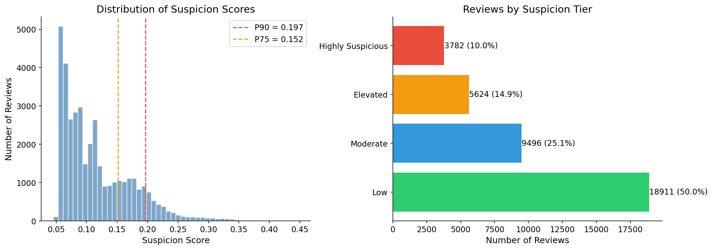
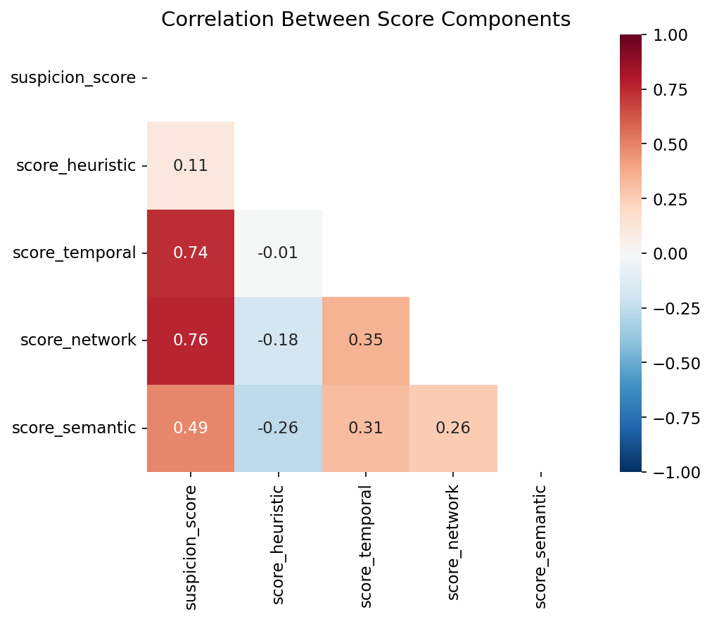
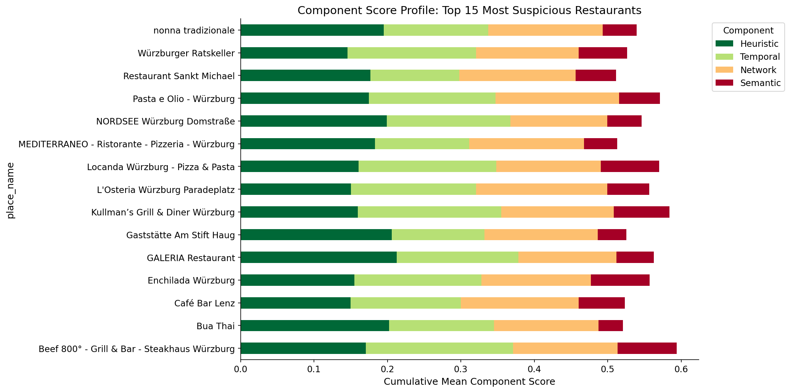

# 🔍 Fake Review Detection — Würzburg Google Maps


> An end-to-end data engineering pipeline that calculates **suspicion scores** for Google Maps restaurant reviews in Würzburg, Germany — combining behavioral metadata, temporal patterns, network analysis, and semantic signals.

---

## Table of Contents

- [About the Project](#about-the-project)
- [The Scraper](#the-scraper)
- [Methodological Foundation](#methodological-foundation)
- [Architecture & Pipeline Overview](#architecture--pipeline-overview)
- [Tech Stack](#tech-stack)
- [Scoring Components & Weights](#scoring-components--weights)
- [Key Findings](#key-findings)
- [Quick Start](#quick-start)
- [Project Structure](#project-structure)
- [Limitations](#limitations)
- [References](#references)

---

## About the Project

This project implements a **production-grade data engineering pipeline** for detecting potentially fake reviews among Google Maps restaurants in Würzburg. It processes **~37,800 reviews** from **121 restaurants**, written by **~29,800 unique reviewers**, and produces a multi-dimensional **suspicion score** for each review.

The suspicion score is explicitly **not a binary label** — it is a continuous indicator of how many known deception signals a review triggers simultaneously. The system combines behavioral metadata, temporal burst detection, reviewer network analysis, and NLP-based semantic signals into a weighted composite score, with a dynamic P90 threshold (informed by Mukherjee et al., 2013; Jindal & Liu, 2008) that flags approximately **10% of reviews** as suspicious — consistent with empirical estimates in the literature.

This is a **solo hobby project** built to practice and demonstrate skills across the modern data engineering and data analysis stack: orchestration, data modeling, containerization, data quality testing, analytical pipeline design, and exploratory data analysis. It is not affiliated with any organization.

---

## The Scraper

The review data was collected using a **custom-built scraper** (separate repository) based on **Playwright**, which reverse-engineers Google Maps' internal API endpoint. The scraper mimics natural user scrolling behavior to avoid bot detection and extracts rich metadata per review — including reviewer profile information, timestamps, star ratings, sub-ratings (food, service, atmosphere), review text, and owner responses.

Scraper repository: [Google Maps Review Scraper](https://github.com/OliKraus95/Google-Maps-Review-Scraper)

---

## Methodological Foundation

The detection approach is grounded in the academic fake review detection literature. The following hierarchy — from most to least reliable — guided the design of all scoring components:

### 1. Hybrid Models & Network Analysis *(Highest Reliability)*

Combining metadata (text, timestamps, ratings) with the relational structure of a reviewer–review–restaurant network is considered the most robust approach. Frameworks like SpEagle leverage the "User-Review-Product" graph to surface suspicious patterns that go beyond individual texts. Because professional spammers often operate in groups and leave relational footprints across multiple venues, these network-based signals are significantly harder to manipulate than text alone. They are effectively "content-agnostic" and consistently outperform isolated text models on real-world datasets such as Yelp — which is structurally very similar to Google Maps (Rayana & Akoglu, 2015; Li et al., 2017).

### 2. Behavioral Features *(High Reliability)*

Analyses on real commercial platforms show that **user behavior is a far stronger deception indicator than linguistic features**. The most reliable behavioral signals include:

- **MNR (Maximum Number of Reviews):** Genuine users rarely post more than one review per day; 75% of identified spammers in studies posted six or more (Mukherjee et al., 2013).
- **RD (Rating Deviation):** Spammers often deviate significantly from the consensus rating to manipulate a venue's overall score (Savage et al., 2015).
- **PR (Percentage of Positive Reviews):** An unnaturally high share of 4- and 5-star reviews (often > 80%) is highly suspicious (Jindal & Liu, 2007).
- **MCS (Maximum Content Similarity):** Spammers frequently reuse text templates across different venues (Li et al., 2011).

In controlled tests, behavioral features achieved approximately **86% accuracy**, while linguistic analysis on the same data often failed (Mukherjee et al., 2013).

### 3. Consistency Analysis *(Fine-grained vs. Coarse-grained)*

When fine-grained sub-ratings (food, service, atmosphere) are available — as in our dataset — discrepancies between these and the overall star rating are highly informative. Genuine reviewers typically differentiate between aspects. Spammers who lack real on-site experience tend to either assign extreme values across the board or produce illogical contradictions between sub-ratings (Feng & Hirst, 2013).

### 4. Profile Compatibility with Factual Claims

Cross-referencing review text against objective restaurant attributes (price range, parking, wait times) is a highly relevant method. Spammers without actual experience frequently produce statements that contradict verifiable facts or omit aspects that genuine visitors almost always mention (Feng & Hirst, 2013).

### 5. Temporal Analysis & Burst Detection

Identifying **bursts** — sudden clusters of reviews in short time windows — is very effective at uncovering coordinated campaigns. **Co-bursting**, where the same groups of reviewer IDs appear simultaneously across different restaurants, is an almost certain sign of professional spam networks. Since genuine reviews arrive randomly over time, such synchronized activity is inherently suspicious (Fei et al., 2013; Xie et al., 2012).

### 6. Advanced NLP Models (Transformers)

Modern models like RoBERTa can detect subtle linguistic patterns invisible to humans and are nearly perfect at distinguishing machine-generated text (e.g., GPT-2/GPT-4) from human text. However, their reliability drops significantly against "smart" human spammers who carefully imitate authentic review styles. On real-world datasets, these models often achieve only about **68% accuracy** — compared to **> 90%** on synthetic benchmarks. Error rates are notably higher on short texts (< 100 words) (Ott et al., 2012; Ren & Zhang, 2016).

### 7. Simple Linguistic Features & Heuristics *(Lowest Reliability)*

Classical approaches relying solely on word frequencies (unigrams, bigrams), text length, or stylistic markers (e.g., excessive first-person pronouns, adjective density) are the least reliable. Spammers adapt quickly to known rules (Goodhart's Law). These methods perform well on cheaply produced fake reviews (e.g., via Amazon Mechanical Turk) but consistently fail against professional spammers who mimic genuine vocabulary. **Human judgment alone hovers around 55–60% accuracy** — barely above chance — because people tend to trust emotional or detailed texts, which is precisely what spammers exploit (Ott et al., 2012; Shojaee et al., 2013).

**Conclusion for Google Maps:** The primary focus lies on **reviewer metadata** (total review count, temporal patterns) and **rating deviation from the restaurant's consensus**, since these signals are already available in the scraped dataset and offer the highest reliability-to-effort ratio.

---

## Architecture & Pipeline Overview

The operational workflow consists of **9 sequential Prefect tasks**. These cover preparation, validation, transformation, feature generation, final scoring, and artifact archival:

```mermaid
flowchart TD
    A["Step 0: Preparation\n─────────────────\nData loading, cleaning,\nID generation, persistence\n(Python, DuckDB)"] --> B["Step 1: Quality Checks\n─────────────────\nSchema and coverage validation\non cleaned data\n(Great Expectations)"]
    B --> C["Step 2: dbt Transformations\n─────────────────\nStaging + mart models,\nconstraint tests\n(dbt, DuckDB)"]
    C --> D["Step 3: Heuristic Scoring\n─────────────────\nBehavioral features,\nrating deviation,\nreview patterns\n(Python, DuckDB)"]
    D --> E["Step 4: Temporal Analysis\n─────────────────\nBurst detection,\nco-bursting patterns,\ntime-window analysis\n(Python, DuckDB)"]
    E --> F["Step 5: Network Analysis\n─────────────────\nReviewer–restaurant graph,\ncommunity structure,\nco-reviewer signals\n(NetworkX)"]
    F --> G["Step 6: Semantic Analysis\n─────────────────\nEmbedding similarity,\nsentiment mismatch,\nkeyword-based fact checks\n(sentence-transformers, GPU)"]
    G --> H["Step 7: Final Scoring\n─────────────────\nWeighted composite score,\npercentile thresholding\n(Python, DuckDB)"]
    H --> I["Step 8: Storage Upload\n─────────────────\nUpload raw, processed,\nand output artifacts to MinIO\n(boto3, MinIO)"]

    style A fill:#4A90D9,stroke:#2C5F8A,color:#fff
    style B fill:#7B68EE,stroke:#5A4CB5,color:#fff
    style C fill:#E67E22,stroke:#A85C18,color:#fff
    style D fill:#27AE60,stroke:#1B7A43,color:#fff
    style E fill:#E74C3C,stroke:#A83229,color:#fff
    style F fill:#F39C12,stroke:#B07410,color:#fff
    style G fill:#1ABC9C,stroke:#128A72,color:#fff
    style H fill:#8E44AD,stroke:#66307D,color:#fff
    style I fill:#546E7A,stroke:#37474F,color:#fff
```



| Step | Script / Tool | Purpose |
|------|---------------|---------|
| 0 | `preparation.py` | Load raw scraped data into DuckDB, clean records, generate derived fields, and persist analytical base tables |
| 1 | `quality_checks_ge.py` | Validate the cleaned dataset with Great Expectations before downstream scoring |
| 2 | `dbt` (`dbt run` + `dbt test`) | Build staging and mart models in DuckDB and run model-level integrity tests |
| 3 | `heuristic_scoring.py` | Calculate behavioral features such as rating deviation, review frequency, and detail-level signals |
| 4 | `temporal_analysis.py` | Detect review bursts and co-bursting patterns across time windows |
| 5 | `network_analysis.py` | Build the reviewer–restaurant graph and compute network-based suspicion signals |
| 6 | `semantic_analysis.py` | Compute embedding similarity, sentiment mismatches, and keyword-based text/attribute contradiction checks |
| 7 | `scoring.py` | Combine all component scores into a weighted composite suspicion score with a dynamic P90 threshold |
| 8 | `storage.py` | Upload raw, processed, and output artifacts to MinIO object storage |

All scripts share a centralized configuration via `scripts/config.py` (no hardcoded paths or credentials).

### Prefect Flow Run (Screenshot)


---

## Tech Stack

| Tool | Purpose | Why This Tool |
|------|---------|---------------|
| **Python 3.11+** | Core pipeline language | Ecosystem for data engineering and NLP |
| **DuckDB** | Analytical database | Embedded OLAP DB — fast columnar queries without a server, ideal for local analytical workloads |
| **dbt** | Data modeling & testing | SQL-based transformations with built-in testing (6 models, 31 tests); industry-standard for analytics engineering |
| **Prefect** | Workflow orchestration | Modern Python-native orchestrator with minimal boilerplate; handles retries, logging, and observability |
| **Great Expectations** | Data quality validation | Declarative expectation suite for validating the cleaned dataset before downstream modeling and scoring |
| **MinIO** | Object storage (S3-compatible) | Self-hosted S3-compatible storage for Parquet artifacts; mirrors production cloud patterns locally |
| **NetworkX** | Graph analysis | Reviewer–restaurant network construction, community detection, and co-reviewer signal computation |
| **sentence-transformers** | Semantic embeddings | Pre-trained German language models for review similarity and sentiment analysis (GPU-accelerated) |
| **Docker Compose** | Containerization | Reproducible multi-service environment for the pipeline, MinIO, Prefect Server, and Jupyter with GPU passthrough (GTX 1070) |
| **Playwright** | Web scraping *(separate repo)* | Headless browser automation for reverse-engineering Google Maps' internal API |

---

## Scoring Components & Weights

The final suspicion score is a weighted composite of 12 individual signals, each normalized to [0, 1] before aggregation. Component keys and weights are taken directly from `scripts/scoring.py` (`SCORE_WEIGHTS`, sum = 1.0):

| # | Component | Category | Weight | Key Reference |
|---|-----------|----------|--------|---------------|
| 1 | `network_score` (network-based suspicion) | Network | `0.35` | Rayana & Akoglu, 2015 |
| 2 | `burst_suspicion_score` (temporal burst signal) | Temporal | `0.15` | Fei et al., 2013 |
| 3 | `rating_deviation_score` (deviation from restaurant mean) | Behavioral | `0.10` | Savage et al., 2015 |
| 4 | `consistency_score` (sub-rating consistency) | Behavioral | `0.08` | Feng & Hirst, 2013 |
| 5 | `mnr_score` (max reviews/day behavior) | Behavioral | `0.07` | Mukherjee et al., 2013 |
| 6 | `mcs_score` (maximum content similarity) | Semantic/NLP | `0.06` | Li et al., 2011 |
| 7 | `pr_score` (positive-review ratio) | Behavioral | `0.05` | Jindal & Liu, 2007 |
| 8 | `detail_level_score` (review detail level) | Behavioral | `0.05` | Mukherjee et al., 2013 |
| 9 | `fact_compatibility_score` (text-attribute contradictions) | Semantic/NLP | `0.03` | Feng & Hirst, 2013 |
| 10 | `attr_template_score` (attribute template signal; currently disabled but kept for compatibility) | Semantic/NLP | `0.02` | Mohawesh et al., 2021 |
| 11 | `sentiment_star_inconsistency` (sentiment vs. star mismatch) | Semantic/NLP | `0.02` | Ott et al., 2012 |
| 12 | `sentiment_subrating_inconsistency` (sentiment vs. sub-rating mismatch) | Semantic/NLP | `0.02` | Ott et al., 2012 |

> **Threshold:** A dynamic **P90 threshold** flags the top ~10% of reviews as suspicious, consistent with empirical fake review prevalence estimates (Mukherjee et al., 2013; Ott et al., 2012).

---

## Key Findings

The full exploratory analysis is available in [`notebooks/Analysis.ipynb`](notebooks/Analysis.ipynb).
For direct repository viewing, use: [Analysis Notebook (GitHub)](https://github.com/OliKraus95/Google-Maps-Fake-Review-Detector/blob/main/notebooks/Analysis.ipynb).
Below is a summary of the key results.

### Dataset Overview

| Metric | Value |
|--------|-------|
| Total reviews | 37,813 |
| Restaurants | 121 |
| Unique reviewers | 29,823 |
| Time range | Sep 2010 – Mar 2026 |
| Flagged as suspicious (> P90) | 3,782 (10.0%) |
| Suspicion score range | 0.046 – 0.447 |

The 10.0% flagging rate is consistent with empirical estimates in the fake review detection literature (Mukherjee et al., 2013: 8–15%).

### Score Distribution



The suspicion score distribution is heavily right-skewed (median 0.099, mean 0.117). Most reviews show minimal suspicious signals, while a long tail extends to 0.447. The P90 threshold at 0.197 cleanly separates the top 10%.

Suspicious reviews have notably lower star ratings (avg. 3.76) than unsuspicious ones (avg. 4.58), suggesting the pipeline primarily detects negative low-effort reviews and potential competitor sabotage — consistent with Google Maps' heavy skew toward 5-star ratings.

### What Drives Suspicion: Component Analysis



The four scoring dimensions contribute differently to the composite score:

| Component | Correlation with composite | Avg. score | Role |
|-----------|---------------------------|------------|------|
| **Network** | r = 0.76 | 0.143 | Primary driver — spikes for anomalous reviewer overlap patterns |
| **Temporal** | r = 0.74 | 0.126 | Co-primary driver — captures burst patterns and rating deviation |
| **Semantic** | r = 0.49 | 0.051 | Moderate contributor — sentiment contradictions and content similarity |
| **Heuristic** | r = 0.11 | 0.165 | Broad baseline — highest absolute mean but low differentiation |

The heuristic component has the highest absolute mean but barely differentiates between suspicious and unsuspicious reviews. Network and temporal scores, by contrast, are low for most reviews and spike sharply for anomalous ones — making them the strongest discriminators.

Notably, the four dimensions correlate weakly to negatively with each other (−0.01 to −0.26), confirming they capture **distinct suspicion types** rather than redundant signals.

### Restaurant-Level Patterns



The stacked bar chart reveals distinct suspicion profiles across restaurants. Some key observations:

- **L'Osteria** stands out with extreme temporal bursts: 38 suspicious reviews in February 2026 and 32 in January 2026, suggesting a possible coordinated campaign or viral incident.
- **Kullman's Grill & Diner** has the highest average suspicion score (0.142) with 18% of reviews flagged — driven primarily by heuristic and temporal signals.
- **Beef 800°** shows a similar pattern (18% flagged) with the strongest temporal component among the top 3.
- Different restaurants have **different suspicion profiles**: some are flagged primarily through network signals, others through temporal bursts — the multi-score approach captures this heterogeneity.

### Temporal Patterns

Review volume grew dramatically from 2023 onward, peaking at >1,500 reviews/month in late 2025. The suspicious fraction grows proportionally, with notable bursts at specific restaurants. Saturday evening (6–8 PM) is the temporal hotspot for suspicious reviews — correlating with peak dining hours.

### Semantic Clustering

A UMAP projection of sentence-transformer embeddings (384-dim) with DBSCAN clustering found 34 clusters but **no clear semantic separation** between suspicious and unsuspicious reviews (score spread across clusters: only 0.069). This is a realistic result: fake reviews in Würzburg are linguistically heterogeneous — individual paid reviews or favor-based ratings rather than template-based campaigns. The multi-score approach compensates for this, as what semantics cannot detect, temporal and network signals catch.

---

## Data Quality & SQL Access

### dbt: 6 Models, 31 Tests

The pipeline includes a full [dbt](https://www.getdbt.com/) project that transforms raw scraped data into a dimensional model (staging → marts) and validates data integrity at every layer. All 31 tests pass consistently:
```
$ dbt test

Running with dbt=1.10.20
Found 6 models, 31 data tests, 1 source

Completed successfully

Done. PASS=31 WARN=0 ERROR=0 SKIP=0 TOTAL=31
```

Tests cover not-null constraints, uniqueness of primary keys, accepted value ranges (e.g., star ratings must be 1–5), and referential integrity between fact and dimension tables.

### Querying the Results

All pipeline outputs are stored as Parquet files and can be queried directly with DuckDB — no server required:
```sql
SELECT place_name,
       ROUND(AVG(suspicion_score), 3) AS avg_score,
       COUNT(*) AS n_reviews,
       SUM(CASE WHEN suspicion_score >= 0.197 THEN 1 ELSE 0 END) AS n_flagged
FROM read_parquet('data/processed/reviews_with_suspicion_scores.parquet')
GROUP BY place_name
ORDER BY avg_score DESC
LIMIT 10;
```
```
                                     place_name  avg_score  n_reviews  n_flagged
 Kullman's Grill & Diner Würzburg                  0.142        392         70
 GALERIA Restaurant                                0.139        107         11
 Beef 800° - Grill & Bar - Steakhaus Würzburg      0.138        260         47
 Locanda Würzburg - Pizza & Pasta                   0.135        261         42
 nonna tradizionale                                 0.134        400         50
 NORDSEE Würzburg Domstraße                         0.134        400         29
 Enchilada Würzburg                                 0.134        210         34
 L'Osteria Würzburg Paradeplatz                     0.133        270         32
 Pasta e Olio - Würzburg                            0.133        400         62
 Gaststätte Am Stift Haug                           0.131        355         48
```

## Quick Start

### Prerequisites

- Docker & Docker Compose (with GPU support for semantic analysis)
- NVIDIA GPU with CUDA support (tested on GTX 1070)

### Setup

```bash
# Clone the repository
git clone https://github.com/OliKraus95/Google-Maps-Fake-Review-Detector.git
cd Google-Maps-Fake-Review-Detector

# Copy and configure environment variables
cp .env.example .env
# Edit .env with your MinIO credentials and paths

# Start required infrastructure
docker compose up -d minio minio-init prefect-server

# Run the pipeline once
docker compose --profile pipeline up pipeline

# Optional: start Jupyter for exploration
docker compose up -d jupyter
```

The Prefect flow executes 9 sequential tasks: preparation, data quality checks, dbt transformations, heuristic scoring, temporal analysis, network analysis, semantic analysis, final scoring, and MinIO upload.

No raw, processed, or exported review datasets are included in this repository. They are intentionally excluded for GDPR compliance because the underlying source material may contain personal data such as reviewer names, profile identifiers, and other potentially identifying metadata.

---

## Project Structure

```
fake-review-detection/
├── docker-compose.yml
├── Dockerfile
├── .env.example
├── .gitignore
├── requirements.txt
├── README.md
├── assets/
│   └── plots/                  # Selected analysis plots for README
├── scripts/                    # Core pipeline implementation
│   ├── config.py
│   ├── preparation.py
│   ├── heuristic_scoring.py
│   ├── temporal_analysis.py
│   ├── network_analysis.py
│   ├── semantic_analysis.py
│   ├── scoring.py
│   ├── storage.py
│   ├── quality_checks_ge.py
│   └── create_debug_raw_sample.py
├── flows/                      # Prefect orchestration
│   ├── pipeline.py
│   └── run_pipeline_simple.py
├── dbt/
│   ├── dbt_project.yml
│   ├── profiles.yml
│   ├── models/
│   │   ├── staging/
│   │   ├── marts/
│   │   └── schema.yml
├── expectations/
│   └── reviews_suite.json
├── notebooks/
│   └── Analysis.ipynb           # Exploratory analysis and report figures
└── tests/
    └── __init__.py
```

Notes:
- The tree above is oriented toward the repository itself, not the local working directory state.
- Gitignored local/runtime artifacts are intentionally excluded here, including `data/raw/`, `data/processed/`, `outputs/`, `dbt/target/`, `dbt/logs/`, `.env`, `__pycache__/`, and `.ipynb_checkpoints/`.
- The repository does include selected documentation assets in `assets/plots/` and the analysis notebook in `notebooks/`, while the underlying datasets themselves remain excluded.

---

## Limitations

This project is a portfolio demonstration and comes with important caveats:

1. **No Ground Truth:** The suspicion score is a **continuous indicator**, not a verified label. There is no dataset of confirmed fake Google Maps reviews to validate against. The score reflects how many known deception signals a review triggers — it does not prove that a review is fake.

2. **Sampling Bias:** The scraper collects the **most recent ~400 reviews per restaurant**. Older coordinated campaigns may not be visible in the data.

3. **Network Density:** With only 121 restaurants, the reviewer–restaurant graph is relatively sparse. Co-reviewer and community-detection signals should be interpreted cautiously, as the network may lack the density needed for robust structural patterns.

4. **Language Scope:** The NLP pipeline (sentiment analysis, embedding similarity) is configured exclusively for **German-language reviews**. Reviews in other languages are excluded from semantic analysis.

5. **Fact Compatibility (Proof of Concept):** The fact-compatibility module is implemented as a lightweight keyword-based contradiction check between review text and structured restaurant attributes (for example wait time, parking, price range, or vegetarian options). Because attribute coverage is sparse and matching is intentionally conservative, this signal behaves as a proof of concept rather than a strong discriminator in the final score.

6. **Google's Internal Sorting:** Despite scraping with "newest first" ordering, Google may apply internal filtering or reranking that is not visible to the scraper, potentially biasing which reviews are collected.

7. **Human Baseline:** According to the literature, humans can only detect fake reviews by reading them at roughly **55–60% accuracy** — barely above chance. People tend to trust detailed or emotional texts as authentic, which is precisely what professional spammers exploit (Ott et al., 2012). Any system that consistently exceeds this baseline is already an improvement.

---

## References of Literature used for the methodology

Barbado, R., Araque, O., & Iglesias, C. A. (2019). A framework for fake review detection in online consumer electronics retailers. *Information Processing & Management*, 56(4), 1234–1244.

Choi, K., Yi, J., Park, C., & Yoon, S. (2021). Deep learning for anomaly detection in time-series data: Review, analysis, and guidelines. *IEEE Access*, 9, 120043–120065.

Dematis, I., Karapistoli, E., & Vakali, A. (2017). Fake review detection via exploitation of spam indicators and reviewer behavior characteristics. In *International Conference on Current Trends in Theory and Practice of Informatics* (pp. 581–595). Springer.

Duma, R. A., Niu, Z., Nyamawe, A. S., Tchaye-Kondi, J., Jingili, N., Yusuf, A. A., & Deve, A. F. (2024). Fake reviews detection techniques, issues, and future research directions: A literature review. *Knowledge and Information Systems*, 66(9), 5071–5112.

Elmogy, A. M., Tariq, U., Ammar, M., & Ibrahim, A. (2021). Fake reviews detection using supervised machine learning. *International Journal of Advanced Computer Science and Applications*, 12(1).

Fei, G., Mukherjee, A., Liu, B., Hsu, M., Castellanos, M., & Ghosh, R. (2013). Exploiting burstiness in reviews for review spammer detection. In *Proceedings of the International AAAI Conference on Web and Social Media* (Vol. 7, No. 1, pp. 175–184).

Feng, S., Xing, L., Gogar, A., & Choi, Y. (2012). Distributional footprints of deceptive product reviews. In *Proceedings of the International AAAI Conference on Web and Social Media* (Vol. 6, No. 1, pp. 98–105).

Feng, V. W., & Hirst, G. (2013). Detecting deceptive opinions with profile compatibility. In *Proceedings of the Sixth International Joint Conference on Natural Language Processing* (pp. 338–346).

Hussain, N., Mirza, H. T., Hussain, I., Iqbal, F., & Memon, I. (2020). Spam review detection using the linguistic and spammer behavioral methods. *IEEE Access*, 8, 53801–53816.

Ignat, O., Xu, X., & Mihalcea, R. (2024). Maide-up: Multilingual deception detection of GPT-generated hotel reviews. *arXiv preprint arXiv:2404.12938*.

Jindal, N., & Liu, B. (2007). Review spam detection. In *Proceedings of the 16th International Conference on World Wide Web* (pp. 1189–1190).

Jindal, N., & Liu, B. (2008). Opinion spam and analysis. In *Proceedings of the 2008 International Conference on Web Search and Data Mining* (pp. 219–230).

Kumar, N., Venugopal, D., Qiu, L., & Kumar, S. (2019). Detecting anomalous online reviewers: An unsupervised approach using mixture models. *Journal of Management Information Systems*, 36(4), 1313–1346.

Li, F., Huang, M., Yang, Y., & Zhu, X. (2011). Learning to identify review spam. In *IJCAI Proceedings — International Joint Conference on Artificial Intelligence* (Vol. 22, No. 3, p. 2488).

Li, H., Fei, G., Wang, S., Liu, B., Shao, W., Mukherjee, A., & Shao, J. (2017). Bimodal distribution and co-bursting in review spam detection. In *Proceedings of the 26th International Conference on World Wide Web* (pp. 1063–1072).

Mohawesh, R., Xu, S., Tran, S. N., Ollington, R., Springer, M., Jararweh, Y., & Maqsood, S. (2021). Fake reviews detection: A survey. *IEEE Access*, 9, 65771–65802.

Mukherjee, A., Venkataraman, V., Liu, B., & Glance, N. (2013). Fake review detection: Classification and analysis of real and pseudo reviews. *UIC-CS-03-2013. Technical Report*.

Mukherjee, A., Venkataraman, V., Liu, B., & Glance, N. (2013). What Yelp fake review filter might be doing? In *Proceedings of the International AAAI Conference on Web and Social Media* (Vol. 7, No. 1).

Ott, M., Cardie, C., & Hancock, J. (2012). Estimating the prevalence of deception in online review communities. In *Proceedings of the 21st International Conference on World Wide Web* (pp. 201–210).

Rayana, S., & Akoglu, L. (2015). Collective opinion spam detection: Bridging review networks and metadata. In *Proceedings of the 21st ACM SIGKDD International Conference on Knowledge Discovery and Data Mining* (pp. 985–994).

Ren, Y., & Zhang, Y. (2016). Deceptive opinion spam detection using neural network. In *Proceedings of COLING 2016, the 26th International Conference on Computational Linguistics: Technical Papers* (pp. 140–150).

Rout, J. K., Dalmia, A., Choo, K. K. R., Bakshi, S., & Jena, S. K. (2017). Revisiting semi-supervised learning for online deceptive review detection. *IEEE Access*, 5, 1319–1327.

Rout, J. K., Singh, S., Jena, S. K., & Bakshi, S. (2017). Deceptive review detection using labeled and unlabeled data. *Multimedia Tools and Applications*, 76(3), 3187–3211.

Salminen, J., Kandpal, C., Kamel, A. M., Jung, S. G., & Jansen, B. J. (2022). Creating and detecting fake reviews of online products. *Journal of Retailing and Consumer Services*, 64, 102771.

Savage, D., Zhang, X., Yu, X., Chou, P., & Wang, Q. (2015). Detection of opinion spam based on anomalous rating deviation. *Expert Systems with Applications*, 42(22), 8650–8657.

Shojaee, S., Murad, M. A. A., Azman, A. B., Sharef, N. M., & Nadali, S. (2013). Detecting deceptive reviews using lexical and syntactic features. In *2013 13th International Conference on Intelligent Systems Design and Applications* (pp. 53–58). IEEE.

Xie, S., Wang, G., Lin, S., & Yu, P. S. (2012). Review spam detection via temporal pattern discovery. In *Proceedings of the 18th ACM SIGKDD International Conference on Knowledge Discovery and Data Mining* (pp. 823–831).


